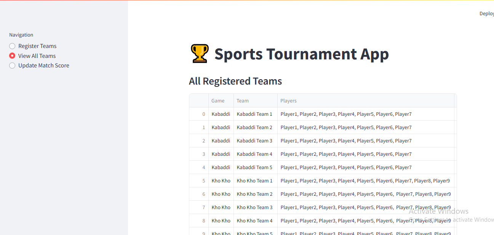
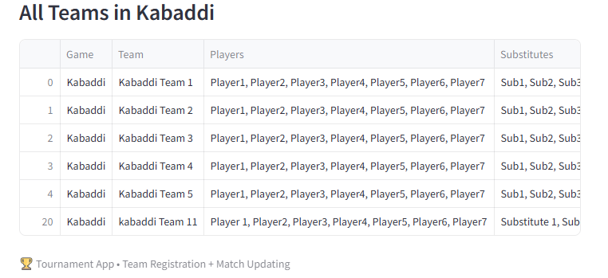
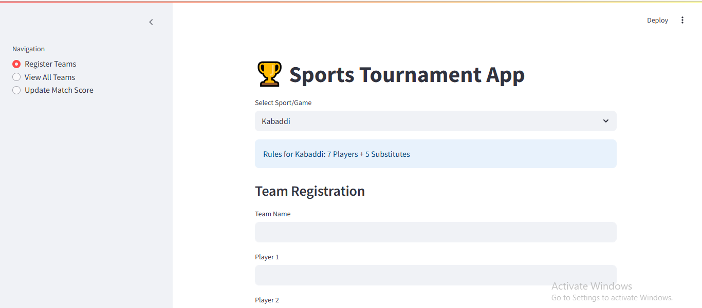

# Sports-Tournament-app
A Streamlit-based Sports Tournament Management System that allows registering teams, managing multiple sports, validating players, updating match scores, and generating real-time rankings. Data is stored in CSV for easy access, making it ideal for schools, colleges, and sports clubs.

The Sports Tournament Management System is a fully functional, data-driven application built using Python, Streamlit, and Pandas, designed to simplify the organization and monitoring of sports tournaments. The system enables administrators to register teams, maintain player lists, update match results, and automatically generate live scoreboards — all stored efficiently in CSV format for easy maintenance and portability.

This project supports multiple sports such as Kabaddi, Kho-Kho, Basketball, and Volleyball, each with predefined player and substitute limits to ensure accurate team validation. The interface is clean, user-friendly, and structured in such a way that even non-technical coordinators can manage tournaments effortlessly.

The app automatically calculates and updates essential match statistics including Wins, Losses, Draws, Matches Played, Goals/Points For, Goals/Points Against, Goal Difference, and Total Points using standard tournament point rules. Team data is dynamically updated in a central CSV file (sports_tournament_dataset.csv) that serves as the core database.

Overall, the project provides an end-to-end tournament management solution suitable for schools, colleges, sports clubs, and event organizers, while also demonstrating practical skills in data processing, UI development, validations, and Python automation.

⭐ Key Highlights

Multi-sport support with automated player validation

Team registration with duplicate protection

Direct match result updates with score & point calculations

Auto-generated scoreboard and rankings

Persistent data storage using CSV files

Clean Streamlit UI for easy navigation

Portable and lightweight system with no external database

🔧 Technologies Used

Python 3.x

Streamlit

Pandas

CSV Data Storage

